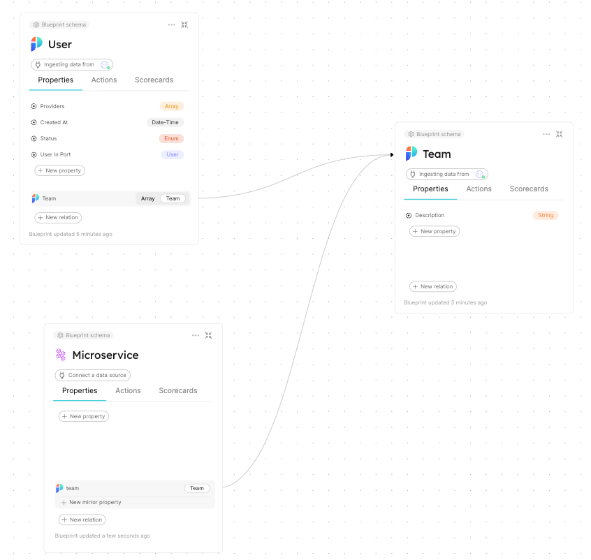
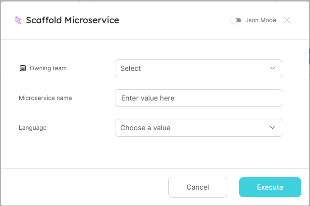
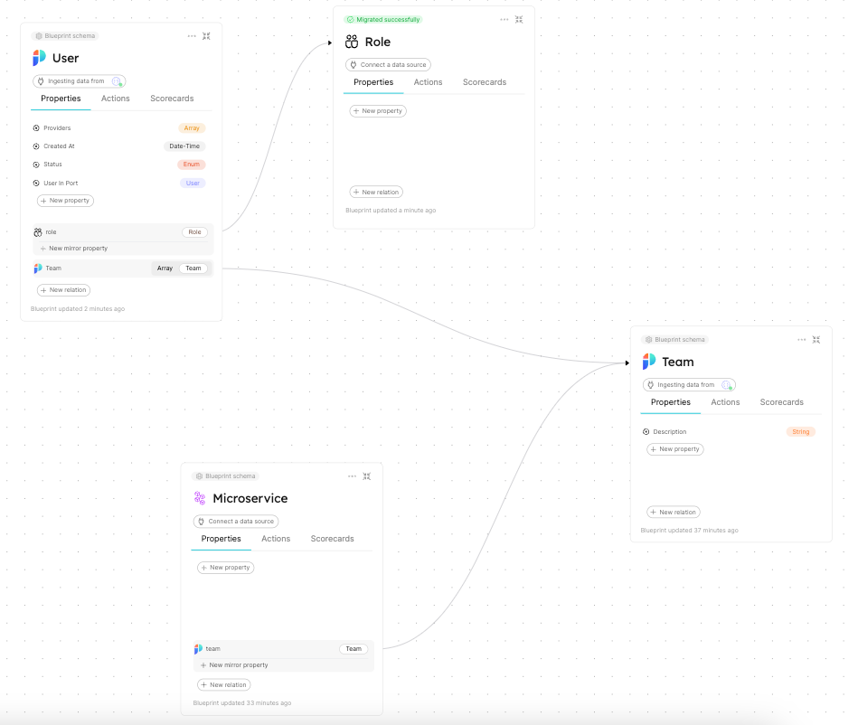
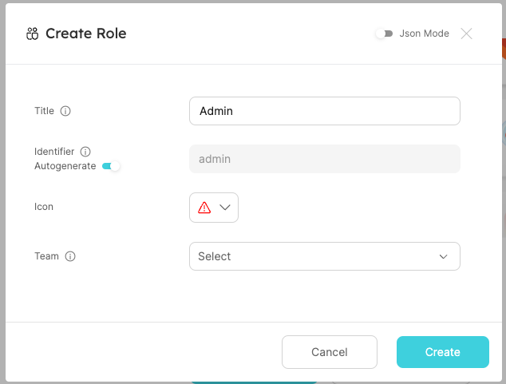

# Port RBAC
This readme will provide a short walkthrough on how to apply RBAC to Port's Actions.

## Prerequisits
In order to manage RBAC as described below, you will need to create Port users and teams blueprints + entities in the catalog.
This can be done by using the following [script](https://github.com/port-labs/example-port-organization-data).

In this walkthrough, we will be utilizing Port's [Dynamic Permissions](https://docs.getport.io/create-self-service-experiences/set-self-service-actions-rbac/dynamic-permissions), which we recommend to read before proceeding to the examples.

## Users and Teams
After creating the teams and users entities in the catalog, create relations from your blueprints to the user and team blueprints, and populate the relations with data.

In this example, we have the following data structure:



Where Users are part of teams, and Microservices are owned by teams, Lets create a new Action `Scaffold Microservice` with the following form:



Owning team is defined as entity selection on blueprint team:

```yaml showLineNumbers
    "owningTeam": {
      "type": "string",
      "blueprint": "team",
      "title": "Owning team",
      "format": "entity"
    }
```

In this example, we are going to make sure the user who is running the action is assigning the Microservice to his team.

Head to the Builder, expand the Microservice blueprint, and in the 3 dot menu, select Permissions. Inside, scroll to the execute section of the Action, and add the following policy:

```json
"policy": {
            "queries": {
                "executingUsers": {
                    "rules": [
                        {
                            "operator": "=",
                            "property": "$blueprint",
                            "value": "user"
                        },
                        {
                            "operator": "=",
                            "property": "$identifier",
                            "value": "{{.trigger.user.email}}"
                        },
                        {
                            "operator": "relatedTo",
                            "blueprint": "team",
                            "value": "{{.inputs.owningTeam}}"
                        }
                    ],
                    "combinator": "and"
                }
            },
            "conditions": [
                ".results.executingUser.entities | length > 0"
            ]
        }
```

Lets examine the policy by going through the rules:

1. The first rule searches for entities that are of blueprint `user`.
2. The second rule searches for entities that their identifier matches the email of the triggering user.
3. The third rule searches for entities related to the team entity selected in the Owning team input (notated by its identifeier `owningTeam`).

Combining all 3 rules together, we are searching for the entity matching the triggering user, that is also related to the team entity selected. If we found an entity, it means that the user is related to the Team.

Then, the condition is checking if the result array is empty. If its not empty, it means that the user is related to the team, and the action will be allowed to trigger.

## Roles
Port allows you to manually create entities, which is how you will create roles in your catalogue. It's as simple as creating a new Blueprint named Roles, and update the data model to include a relation from User to Role like so:



Then, head to your Roles Catalog page, and lets create the admin role:



And populate the relation (related User entities to the Admin role).

Using Port's search API, updating the Action to only be executable by admins is as simple as adding another search rule:

```json
"policy": {
            "queries": {
                "executingUsers": {
                    "rules": [
                        {
                            "operator": "=",
                            "property": "$blueprint",
                            "value": "user"
                        },
                        {
                            "operator": "=",
                            "property": "$identifier",
                            "value": "{{.trigger.user.email}}"
                        },
                        {
                            "operator": "relatedTo",
                            "blueprint": "team",
                            "value": "{{.inputs.owningTeam}}"
                        },
                        {
                            "operator": "relatedTo",
                            "blueprint": "role",
                            "value": "admin"
                        }
                    ],
                    "combinator": "and"
                }
            },
            "conditions": [
                ".results.executingUser.entities | length > 0"
            ]
        }
```

By adding the following rule, we are checking if the user entity of the triggering user, is also related to the admin role. If you want to allow execution for multiple roles, you can create a nested search query like so:

```json
"policy": {
          "queries": {
            "executingUsers": {
              "rules": [
                {
                  "value": "user",
                  "operator": "=",
                  "property": "$blueprint"
                },
                {
                  "value": "{{.trigger.user.email}}",
                  "operator": "=",
                  "property": "$identifier"
                },
                {
                  "value": "{{.inputs.owningTeam}}",
                  "operator": "relatedTo",
                  "blueprint": "team"
                },
                {
                    "combinator": "or",
                    "rules": [
                        {
                            "operator": "relatedTo",
                            "blueprint": "role",
                            "value": "admin"
                        },
                        {
                            "operator": "relatedTo",
                            "blueprint": "role",
                            "value": "moderator"
                        }
                    ]
                }
              ],
              "combinator": "and"
            }
          },
          "conditions": [
            ".results.executingUser.entities | length > 0"
          ]
        }
```

As we can see in this policy, the search query looks for relation to multiple roles, notated by the `or` combinator.
